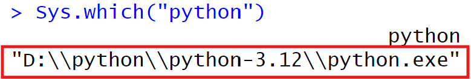
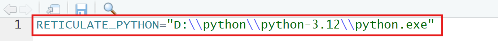

Installing Python and Required packages on Windows 1. Download and
Install python Go to <https://www.python.org/downloads/windows/> and
download the “Windows installer (64-bit)”.

Run the installer, check “Add python.exe to PATH,” and then click
Install Now.

1.  Link R to Python 2.1 Open RStudio and run:

<!-- -->

    #install.packages("reticulate") # Skip if reticulate is already installed

    Sys.which("python")

Copy the path that Sys.which(“python”) prints (see the first screenshot)
 2.2 Run:

    usethis::edit_r_environ()

This code will open .Renviron. In the .Renviron file that opens, paste a
line like the following (replacing the path with the one you copied):

<figure>

<figcaption aria-hidden="true">Edit .Renviron</figcaption>
</figure>

2.3 Save the file and restart R.

1.  Install python packages from R

<!-- -->

    library(reticulate)
    py_install(c("numpy", "scipy", "numba"), pip = TRUE)

Running these commands installs NumPy, SciPy, and Numba into the Python
interpreter that R now recognizes.
